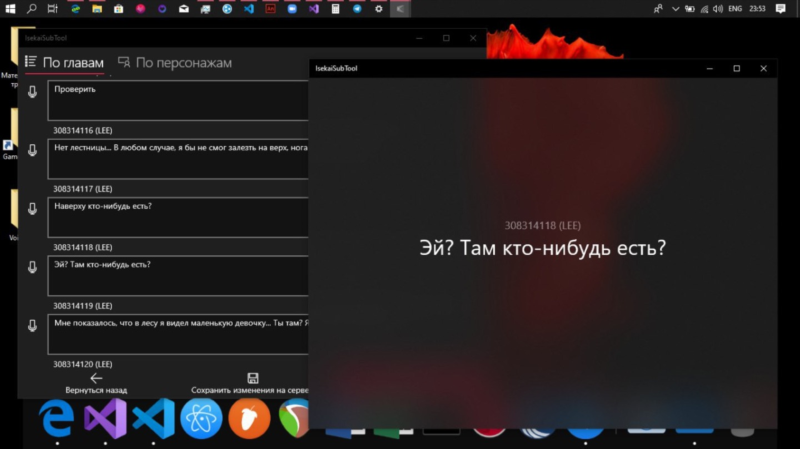

# IsekaiSubTool

[](#overview)
[-512BD4.svg?logo=dotnet&logoColor=white)](#architecture)
[](#architecture)
[](#-origin--story)
[](#disclaimer--legacy-notice)
[-yellow.svg)](#disclaimer--legacy-notice)
[](https://buymeacoffee.com/resonaura)

**IsekaiSubTool** is a specialized voice-acting production and subtitle synchronization workstation developed for a fan dubbing group ("Isekai") working on Telltale Games' *The Walking Dead: Season 1*.


<p align="center">
  
</p>

---

> [!WARNING]
> ### Disclaimer & Legacy Notice
> Developed in **September–October 2019** for Windows 10 and .NET Framework 4.7.2. Archived as a historical milestone of game localization tooling; it has not been tested on Windows 11.

---

## 🎙️ Origin & Story

In autumn 2019, an ambitious fan voice-acting project was initiated to create a full Russian dub of *The Walking Dead: Season 1*. Managing thousands of disparate audio cues, dialogue trees, character assignments, and subtitle translations directly across raw game files was cumbersome for the cast and audio engineers.

IsekaiSubTool was built to serve as an internal production cockpit:
- Parsing extracted Telltale dialogue files (`.txt.json`) into structured scenes and chapter events.
- Providing character-filtered rosters (Lee Everett, Clementine, Kenny, Katjaa, Duck, Carley, Glenn, Hershel, etc.) with avatar portraits.
- Giving voice actors instant access to the English reference script, character cues, and scene context.
- Streamlining audio workflows by supporting direct drag-and-drop export into digital audio workstations (DAWs) using virtual stream buffers.

---

## 🛠️ Architecture

### 1. `wpf/` — Desktop Workstation (Primary)
- **Framework**: C# with WPF and `MahApps.Metro` dark/light theme controls.
- **`DialogsLink.cs`**: Chapter event state engine mapping narrative checkpoints:
  - `Chapter1_CopCar`, `Chapter1_Forest`
  - `Chapter2_ClementineYard`, `Chapter3_ClementineHouse`
  - `Chapter4_HershelsFarm`
  - `Chapter5_Drugstore`, `Chapter5_MotorInnMission`
- **`VirtualFileDataObject.cs`**: Advanced COM IDataObject implementation enabling asynchronous, on-demand drag-and-drop of audio files directly out of the UI into Windows Explorer or audio editors.
- **Custom Components**:
  - `PersListItem.xaml`: Character profile cards with dynamic line counters.
  - `DialogListItem.xaml`: Rich dialogue line displays with translation status badges.
  - `SubTitlePanel.xaml`: Subtitle inspection and timing editor.

### 2. `uwp/` — Universal Windows Prototype
- Earlier iteration built using the Windows 10 Universal Windows Platform (UWP) SDK, featuring fluid XAML grid animations.

### 3. Data & Metadata
- **`dlogs/`**: Scene dialogue trees and script databases parsed from the game engine.
- **`pers/`**: Character portraits and cast identification art.
*(Note: Copyrighted raw game audio clips have been omitted to keep the repository lightweight).*

---

## 📦 Project Structure

```
isekai-sub-tool/
├── wpf/                        # Primary WPF desktop edition
│   ├── IsekaiSubTool WPF.sln   # Visual Studio solution
│   └── IsekaiSubTool WPF/
│       ├── MainWindow.xaml     # Main studio layout
│       ├── DialogsLink.cs      # Chapter & dialogue linker engine
│       ├── VirtualFileDataObject.cs # Windows Explorer OLE drag & drop
│       └── data/
│           ├── dlogs/          # Dialogue script databases (JSON)
│           └── pers/           # Character portrait cards
└── uwp/                        # Historical UWP prototype
    ├── IsekaiSubTool.sln       # UWP solution
    └── IsekaiSubTool/          # Universal Windows project
```
